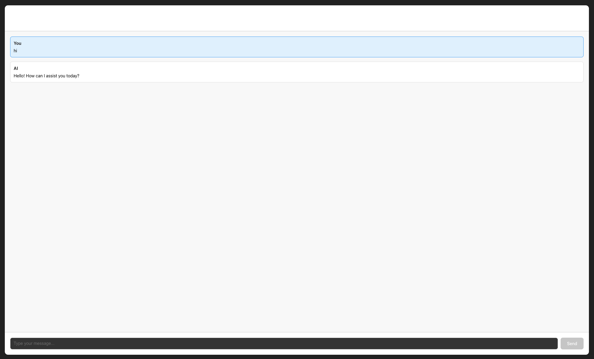

# AI Chatbot

A simple chatbot built with React, TypeScript, and Vercel AI SDK.

<center>
    
</center>

## Why build this?

I was searching for an simple AI chat interface so that I can test some scenarios in the AI api. The closest I could find was the [vercel nextjs template](https://vercel.com/templates/next.js/nextjs-ai-chatbot) which was too complicated for a simple quick spinup.

Also this is a good starting for ai agents to iterate upon and integrate/change features (for example, "replace openai api support with anthropic support").

## How to use?

```bash
git clone git@github.com:aditya-mitra/simple-ai-chat.git
cd simple-ai-chat
npm install
OPENAI_API_KEY=<your-api-key> npm run dev
```

Open [http://localhost:5173](http://localhost:5173) in your browser to see the chat interface.

Simply type your message in the input field and press Send or hit Enter. The AI will respond in real-time with streaming responses.
